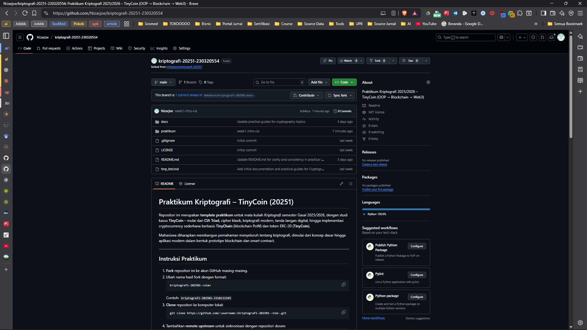
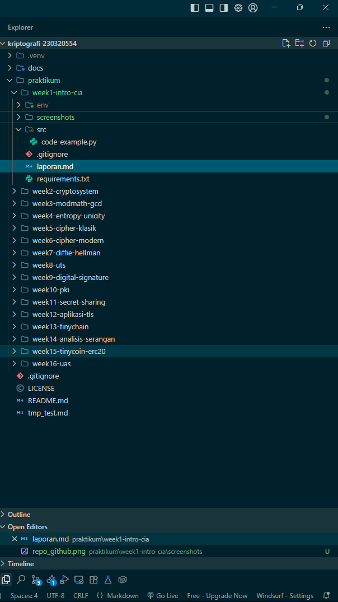
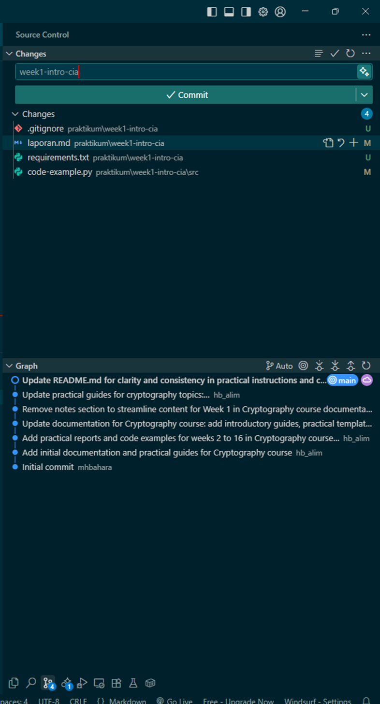

# Laporan Praktikum Kriptografi
Minggu ke-: 1  
Topik: Sejarah Kriptografi & Prinsip CIA  
Nama: Muhammad Nizar Asagaf  
NIM: 230320554  
Kelas: Kriptografi A 5 DSRA

---

## 1. Tujuan
1. Memahami sejarah dan evolusi kriptografi dari masa klasik hingga modern
2. Memahami prinsip dasar Confidentiality, Integrity, Availability (CIA)
3. Memahami peran kriptografi dalam sistem keamanan informasi modern
4. Mempersiapkan repositori GitHub untuk praktikum

---

## 2. Dasar Teori

### Sejarah Kriptografi
Sejarah Kriptografi
Kriptografi berasal dari bahasa Yunani, yaitu kryptos yang berarti “rahasia” dan graphein yang berarti “menulis.” Secara harfiah, kriptografi berarti seni menulis rahasia. Ilmu ini telah dikenal sejak ribuan tahun lalu dan terus berkembang mengikuti kemajuan zaman serta kebutuhan keamanan komunikasi.

Pada era kriptografi klasik, metode penyandian masih bersifat manual dan sederhana. Salah satu metode paling awal adalah Caesar Cipher, yang digunakan oleh Julius Caesar untuk menjaga kerahasiaan pesan militer. Teknik ini bekerja dengan menggeser huruf dalam alfabet sejumlah tertentu, misalnya huruf A digeser tiga langkah menjadi D. Meskipun sederhana, teknik ini efektif pada masa itu karena belum banyak orang memahami konsep penyandian. Selanjutnya, muncul Vigenère Cipher, yang menggunakan kata kunci untuk menentukan pola pergeseran huruf. Metode ini lebih sulit dipecahkan karena menggunakan kombinasi pergeseran yang berubah-ubah, sehingga memperkuat keamanan pesan.

Memasuki era kriptografi modern, perkembangan teknologi komputer membawa perubahan besar. Pada tahun 1940-an, kriptografi mulai dikaitkan dengan ilmu matematika dan teori informasi. Tokoh seperti Claude Shannon memperkenalkan konsep information theory dan menyatakan bahwa keamanan sistem kriptografi dapat diukur secara matematis. Di tahun 1970-an, pemerintah Amerika Serikat memperkenalkan algoritma Data Encryption Standard (DES) sebagai standar enkripsi nasional. Namun, karena kelemahan keamanannya terhadap serangan komputer modern, algoritma tersebut kemudian digantikan oleh Advanced Encryption Standard (AES) pada tahun 2001, yang masih digunakan hingga kini.

Pada periode yang sama, Whitfield Diffie dan Martin Hellman memperkenalkan konsep revolusioner bernama kriptografi kunci publik (public key cryptography). Berbeda dari sistem klasik yang menggunakan satu kunci untuk enkripsi dan dekripsi, sistem ini menggunakan dua kunci berbeda: kunci publik untuk mengenkripsi dan kunci privat untuk mendekripsi. Konsep ini kemudian dikembangkan menjadi algoritma terkenal RSA (Rivest–Shamir–Adleman) pada tahun 1977, yang hingga saat ini menjadi fondasi keamanan di berbagai sistem digital seperti HTTPS, email terenkripsi, dan tanda tangan digital.

Di era kontemporer, kriptografi berperan penting dalam menjaga keamanan dunia digital modern. Teknologi blockchain dan cryptocurrency seperti Bitcoin serta Ethereum menggunakan prinsip kriptografi untuk memastikan integritas dan keaslian transaksi tanpa perlu otoritas pusat. Selain itu, kriptografi kini juga diterapkan dalam berbagai bidang, seperti keamanan jaringan, perlindungan data pribadi, hingga sistem otentikasi berbasis biometrik. Dengan demikian, kriptografi telah berevolusi dari sekadar alat militer menjadi pilar utama dalam keamanan informasi global.

### Prinsip CIA
Prinsip CIA (Confidentiality, Integrity, Availability)

Dalam bidang keamanan informasi, prinsip CIA adalah fondasi utama yang menjadi pedoman untuk menjaga keamanan data dan sistem informasi. CIA merupakan singkatan dari Confidentiality (Kerahasiaan), Integrity (Integritas), dan Availability (Ketersediaan). Ketiga prinsip ini saling berhubungan dan harus diterapkan secara seimbang agar sistem informasi tetap aman, andal, dan dapat dipercaya.

🔒 1. Confidentiality (Kerahasiaan)

Definisi:
Confidentiality adalah prinsip yang menjamin bahwa data atau informasi hanya dapat diakses oleh pihak yang memiliki hak dan otorisasi. Tujuannya adalah untuk mencegah pihak yang tidak berwenang membaca, menyalin, atau menyebarkan informasi sensitif.

Penerapan:

Enkripsi data: Informasi yang dikirimkan melalui internet harus dienkripsi menggunakan algoritma seperti AES atau RSA agar tidak mudah disadap.
Kontrol akses (Access Control): Penggunaan username dan password yang kuat, autentikasi dua faktor (2FA), dan hak akses berbasis peran (role-based access).
Kerahasiaan komunikasi: Aplikasi pesan seperti WhatsApp dan Signal menggunakan end-to-end encryption sehingga hanya pengirim dan penerima yang bisa membaca pesan.

Contoh nyata:
Mahasiswa mengakses portal akademik kampus menggunakan akun pribadi yang dilindungi password. Tanpa autentikasi yang benar, orang lain tidak bisa melihat nilai atau data pribadi mahasiswa tersebut.

🧱 2. Integrity (Integritas)

Definisi:
Integrity adalah prinsip yang memastikan bahwa data tetap utuh, konsisten, dan tidak diubah tanpa izin selama proses penyimpanan, pemrosesan, atau pengiriman. Setiap perubahan yang tidak sah dapat mengancam keandalan informasi dan menimbulkan dampak serius.

Penerapan:

Checksum dan hash function: Data dapat diverifikasi keasliannya menggunakan algoritma hash seperti SHA-256.
Digital signature: Dokumen elektronik diberi tanda tangan digital untuk menjamin keaslian dan memastikan tidak ada perubahan isi.
Version control system: Sistem seperti Git membantu memantau perubahan data dan mendeteksi manipulasi yang tidak sah.

Contoh nyata:
File instalasi sistem operasi biasanya disertai hash checksum. Jika file rusak atau dimodifikasi selama proses unduhan, nilai hash-nya akan berbeda dari aslinya, menandakan integritasnya telah terganggu.

⚙️ 3. Availability (Ketersediaan)

Definisi:
Availability adalah prinsip yang menjamin bahwa sistem, layanan, dan data dapat diakses kapan pun dibutuhkan oleh pengguna yang sah. Sistem yang sering down, rusak, atau tidak bisa diakses akan menghambat kegiatan dan berpotensi menyebabkan kerugian besar.

Penerapan:

Redundansi dan backup: Membuat salinan data di lokasi berbeda agar tetap aman jika terjadi kerusakan sistem.
Load balancing: Membagi beban server agar sistem tetap stabil meskipun banyak pengguna yang mengakses secara bersamaan.
Perlindungan dari serangan DDoS: Menggunakan firewall dan sistem keamanan jaringan untuk menjaga agar layanan tidak terganggu.

Contoh nyata:
Website e-learning universitas menggunakan server cadangan (backup server) dan sistem failover agar tetap bisa diakses mahasiswa saat ujian daring berlangsung, meskipun server utama sedang bermasalah.

---

## 3. Alat dan Bahan
- Laptop/PC dengan koneksi internet
- Akun GitHub (https://github.com)
- Git terinstal di komputer
- Visual Studio Code atau teks editor lainnya
- Web browser (Chrome/Firefox)
- Python 3.x (opsional untuk praktikum lanjutan)

---

## 4. Langkah Percobaan
1. Membuat akun GitHub (jika belum ada)
2. Melakukan fork repositori template dari dosen
3. Mengganti nama repositori menjadi `kripto-20251-230320554`
4. Melakukan clone repositori ke komputer lokal
5. Membuat struktur folder `praktikum/week1-intro-cia/`
6. Mempelajari materi sejarah kriptografi dan prinsip CIA
7. Membuat laporan dalam format Markdown
8. Melakukan commit dan push ke repositori GitHub

---

## 5. Jawaban Quiz
1. Siapa tokoh yang dianggap sebagai bapak kriptografi modern?
Tokoh yang dikenal sebagai bapak kriptografi modern adalah Whitfield Diffie dan Martin Hellman. Keduanya memperkenalkan konsep revolusioner public key cryptography pada tahun 1976 melalui publikasi ilmiah berjudul New Directions in Cryptography.
Sebelum penemuan ini, hampir semua sistem kriptografi bergantung pada satu kunci yang sama untuk proses enkripsi dan dekripsi, yang berarti pengirim dan penerima harus bertukar kunci secara rahasia terlebih dahulu.
Dengan munculnya kriptografi kunci publik, pertukaran informasi dapat dilakukan secara aman melalui jaringan terbuka seperti internet tanpa perlu bertukar kunci secara langsung. Temuan ini membuka jalan bagi pengembangan berbagai algoritma keamanan modern seperti RSA, Diffie–Hellman Key Exchange, dan Elliptic Curve Cryptography (ECC).
Oleh karena kontribusinya yang besar dalam melahirkan era baru keamanan digital, Diffie dan Hellman dianugerahi Turing Award pada tahun 2015, yang dianggap sebagai penghargaan tertinggi di bidang ilmu komputer.
2. Sebutkan algoritma kunci publik yang populer digunakan saat ini.
Salah satu algoritma kunci publik yang paling populer dan banyak digunakan adalah RSA (Rivest–Shamir–Adleman).
RSA dikembangkan pada tahun 1977 dan bekerja berdasarkan prinsip faktorisasi bilangan prima besar — yaitu, keamanan algoritma ini bergantung pada kesulitan memfaktorkan hasil perkalian dua bilangan prima yang sangat besar.
RSA digunakan secara luas dalam berbagai aplikasi keamanan digital seperti:
HTTPS/SSL untuk mengamankan komunikasi antar website dan browser,
Digital Signature untuk memastikan keaslian dan integritas dokumen elektronik,
Email Encryption (PGP/GPG) untuk menjaga kerahasiaan pesan pribadi,
Sertifikat Digital (Public Key Infrastructure) untuk otentikasi identitas online.
Selain RSA, algoritma lain yang juga populer di era modern adalah ECC (Elliptic Curve Cryptography) yang lebih efisien dan kuat dengan ukuran kunci yang lebih kecil.

3. Apa perbedaan utama antara kriptografi klasik dan kriptografi modern?
Perbedaan mendasar antara kriptografi klasik dan kriptografi modern terletak pada kompleksitas algoritma, pendekatan keamanan, serta penerapannya dalam sistem digital:

Aspek	Kriptografi Klasik	Kriptografi Modern
Metode	Menggunakan teknik substitusi dan transposisi huruf.	Menggunakan operasi matematika kompleks, teori bilangan, dan algoritma komputer.
Jenis Kunci	Satu kunci digunakan untuk enkripsi dan dekripsi (symmetric key).	Dapat menggunakan dua kunci berbeda: publik dan privat (asymmetric key).
Media Komunikasi	Digunakan untuk pesan teks sederhana atau komunikasi militer.	Diterapkan dalam jaringan komputer, internet, blockchain, dan sistem keamanan global.
Keamanan	Mudah dipecahkan dengan analisis frekuensi atau brute-force sederhana.	Sangat sulit dipecahkan karena membutuhkan komputasi besar dan algoritma matematis canggih.

Secara umum, kriptografi klasik berfokus pada kerahasiaan pesan dalam bentuk teks, sedangkan kriptografi modern menggabungkan aspek kerahasiaan, integritas, autentikasi, dan non-repudiation untuk mendukung keamanan informasi di dunia digital.

---

## 6. Hasil dan Pembahasan

### Hasil
1. Berhasil membuat repositori GitHub dengan nama `kripto-20251-230320554`
2. Berhasil melakukan fork dari repositori template dosen
3. Berhasil membuat struktur folder sesuai petunjuk
4. Berhasil membuat laporan praktikum

### Screenshot
1. **Repositori GitHub**
   

2. **Struktur Folder**
   

3. **Commit Awal**
   

### Pembahasan
Praktikum ini memberikan pemahaman dasar tentang sejarah kriptografi dan prinsip CIA dalam keamanan informasi. Melalui praktikum ini, saya belajar tentang:
- Perkembangan kriptografi dari masa ke masa
- Pentingnya prinsip CIA dalam melindungi informasi
- Cara menggunakan Git dan GitHub untuk kolaborasi pengembangan perangkat lunak

---

## 7. Analisis Peran Kriptografi

### Contoh Penerapan Prinsip CIA
1. **Confidentiality**
   - **Contoh**: Enkripsi pesan WhatsApp
   - **Penjelasan**: WhatsApp menggunakan protokol Signal untuk mengenkripsi pesan end-to-end, memastikan hanya pengirim dan penerima yang bisa membaca isi pesan.

2. **Integrity**
   - **Contoh**: Digital signature pada dokumen PDF
   - **Penjelasan**: Tanda tangan digital menggunakan kriptografi asimetris untuk memverifikasi bahwa dokumen tidak diubah setelah ditandatangani.

3. **Availability**
   - **Contoh**: Sistem backup cloud
   - **Penjelasan**: Layanan seperti Google Drive menyediakan backup data yang dapat diakses kapan saja, mencegah kehilangan data akibat kerusakan perangkat.
---

## 8. Kesimpulan
Kriptografi merupakan fondasi utama dalam dunia keamanan digital modern. Secara sederhana, kriptografi berfungsi untuk melindungi informasi agar hanya pihak yang berhak saja yang dapat memahami dan mengaksesnya. Proses ini dilakukan melalui teknik penyandian seperti enkripsi (mengubah pesan asli menjadi bentuk tidak terbaca) dan dekripsi (mengembalikannya ke bentuk semula).

Perkembangan kriptografi kini tidak hanya sebatas pada perlindungan pesan rahasia, tetapi juga mencakup aspek keaslian (authenticity), integritas data (integrity), dan non-repudiation atau penolakan atas keaslian pengirim. Dengan kata lain, kriptografi memastikan bahwa data yang dikirim tidak diubah selama proses transmisi, pengirimnya dapat diverifikasi, dan penerima tidak bisa menyangkal telah menerima pesan tersebut.

Teknologi kriptografi saat ini banyak diterapkan dalam kehidupan sehari-hari — mulai dari transaksi perbankan online, pengiriman email aman, hingga sistem autentikasi di media sosial dan layanan cloud. Berbagai algoritma seperti RSA, AES, dan SHA menjadi contoh nyata dari penerapan teori kriptografi yang terus berkembang mengikuti kebutuhan keamanan siber global.

Kesimpulannya, kriptografi bukan hanya ilmu tentang menyembunyikan pesan, tetapi juga tentang menjaga kepercayaan digital di era modern. Dengan kriptografi, setiap individu dan organisasi dapat melindungi data, privasi, dan integritas informasi di tengah ancaman keamanan yang semakin kompleks.

---

## 9. Daftar Pustaka
Stallings, W. (2017). Cryptography and Network Security: Principles and Practice (7th ed.). Pearson Education.
Menezes, A. J., van Oorschot, P. C., & Vanstone, S. A. (1996). Handbook of Applied Cryptography. CRC Press.
Diffie, W., & Hellman, M. E. (1976). New Directions in Cryptography. IEEE Transactions on Information Theory, 22(6), 644–654.
Rivest, R. L., Shamir, A., & Adleman, L. (1978). A Method for Obtaining Digital Signatures and Public-Key Cryptosystems. Communications of the ACM, 21(2), 120–126.
Kementerian Komunikasi dan Informatika Republik Indonesia. (2022). Keamanan Informasi dan Kriptografi di Era Digital. Jakarta: Direktorat Keamanan Informasi.
Schneier, B. (2015). Applied Cryptography: Protocols, Algorithms, and Source Code in C. Wiley Publishing.
Sari, D. (2020). Penerapan Kriptografi Modern dalam Keamanan Data Digital. Jurnal Teknologi Informasi dan Komunikasi, 8(2), 55–63.
Katz, J., & Lindell, Y. (2020). Introduction to Modern Cryptography (3rd ed.). CRC Press.

---

## 10. Commit Log
```
commit 
Author: Muhammad Nizar Asagaf <joenizar470@gmail.com>
Date:   2025-10-06

    week1-intro-cia: week1-intro-cia
    
    - Menyelesaikan laporan praktikum minggu 1
    - Menambahkan screenshot bukti
    - Memperbarui README.md
```
