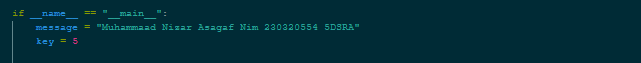

# Laporan Praktikum Kriptografi
Minggu ke-: 2  
Topik: CRYPTOSYSTEM  
Nama: MUHAMMAD NIZAR ASAGAF  
NIM: 230320554  
Kelas: 5DSRA  

---

## 1. Tujuan
Setelah mengikuti praktikum ini, mahasiswa diharapkan mampu:  
1. Mengidentifikasi komponen dasar kriptosistem (plaintext, ciphertext, kunci, algoritma).  
2. Menggambarkan proses enkripsi dan dekripsi sederhana.  
3. Mengklasifikasikan jenis kriptosistem (simetris dan asimetris). 

---

## 2. Dasar Teori
(Ringkas teori relevan (cukup 2–3 paragraf).  
Contoh: definisi cipher klasik, konsep modular aritmetika, dll.  )

Kriptografi klasik berkaitan dengan perancangan dan penggunaan kode (juga disebut
cipher) yang memungkinkan dua pihak berkomunikasi secara diam-diam di hadapan seorang penyadap yang dapat memantau semua komunikasi di antara mereka. Dalam bahasa modern,
kode disebut skema enkripsi dan itulah terminologi yang akan kita gunakan di sini. Keamanan
semua skema enkripsi klasik bergantung pada sebuah rahasia sebuah kunci yang dibagikan
oleh pihak-pihak yang berkomunikasi sebelumnya dan tidak diketahui oleh penyadap.
Skenario ini dikenal sebagai pengaturan kunci pribadi (atau kunci bersama/rahasia), dan
enkripsi kunci pribadi hanyalah salah satu contoh primitif kriptografi yang digunakan dalam
pengaturan ini. Sebelum menjelaskan beberapa skema enkripsi historis, kita membahas
enkripsi kunci pribadi secara lebih umum. Tipe sandi klasik utama adalah sandi transaparansi dimana ia mengatur antara huruf pada pesan dan sandi yang disubstitusi, dimana secara sistematis mengganti huruf atau grup kata dengan kata lainnya dengan grup kata. Contoh dari sandi transaparansi adalah Caesar Cipher. 

Konsep Modular Aritmatika
Modular aritmatika adalah konsep matematika yang menggabungkan operasi aritmatika (penjumlahan, pengurangan, perkalian, dan pembagian) dengan operasi modular (sisa pembagian). Modular aritmatika sering digunakan dalam kriptografi untuk menghitung kunci enkripsi dan dekripsi. Modular aritmatika sering digunakan dalam kriptografi untuk menghitung kunci enkripsi dan dekripsi. Modular aritmatika sering digunakan dalam kriptografi untuk menghitung kunci enkripsi dan dekripsi. 
Aritmatika modular sangat berperan dalam kriptografi karena banyak digunakan dalam algoritma enkripsi, baik untuk enkripsi simetris maupun untuk public key cryptography. Dalam aritmatika modular, konsep gcd digunakan antara lain untuk operasi inverse. Gcd dapat dikalkulasi secara efisien menggunakan algoritma Euclid, algoritma sangat penting yang telah berusia lebih dari 2000 tahun. Bab ini menjelaskan gcd, algoritma Euclid dan aritmatika modular. Akan tetapi, sebelum itu, kita definisikan terlebih dahulu beberapa struktur aljabar yang banyak digunakan dalam aritmatika, yaitu group,monoid, ring dan field.

Sistem Kriptografi 
a. Berdasarkan Jenis Kunci
1. Enkripsi Simetris
2. Enkripsi Asimetris

b. Berdasarkan Jenis Algoritma
1. Enkripsi Subtitusi
2. Enkripsi Transposisi

c. Berdasarkan Jenis operasi
1. Substitusion Cipher
2. Transpotition Cipher
3. Hybrid Cryptosystem
---

## 3. Alat dan Bahan
(- Python 3.x  
- Visual Studio Code / editor lain  
- Git dan akun GitHub  
- Library tambahan (misalnya pycryptodome, jika diperlukan)  )

---

## 4. Langkah Percobaan
(Tuliskan langkah yang dilakukan sesuai instruksi.  
Contoh format:
1. Membuat file `caesar_cipher.py` di folder `praktikum/week2-cryptosystem/src/`.
2. Menyalin kode program dari panduan praktikum.
3. Menjalankan program dengan perintah `python caesar_cipher.py`.)

---

## 5. Source Code
(Salin kode program utama yang dibuat atau dimodifikasi.  
Gunakan blok kode:

```python
# contoh potongan kode
def encrypt(text, key):
    return ...
```
)

---

## 6. Hasil dan Pembahasan
(- Lampirkan screenshot hasil eksekusi program (taruh di folder `screenshots/`).  
- Berikan tabel atau ringkasan hasil uji jika diperlukan.  
- Jelaskan apakah hasil sesuai ekspektasi.  
- Bahas error (jika ada) dan solusinya. 

Hasil dan Pembahasan Kode caesar_cipher.py
Adalah implementasi dari sebuah algoritma berdasarkan pergeseran huruf pada sebuah teks. 
Fungsinya adalah untuk mengenkripsi dan mendekripsi sebuah teks dengan pergeseran huruf pada teks tersebut.
- encrypt(plaintext, key) yaitu untuk mengenkripsi sebuah teks dengan pergeseran huruf pada teks tersebut.
- decrypt(ciphertext, key) yaitu untuk mendekripsi sebuah teks dengan pergeseran huruf pada teks tersebut.
dengan key 5
dalam kode caesar_cipher.py terdapat inputnya yaitu berupa plaintext [Muhammad Nizar Asagaf 230320554 5DSRA]
dan outputnya yaitu berupa ciphertext [Ryqjwhwf Qjwifwf Fwfjwf 230320554 5DSRA]
dan hasil dekripsi yaitu berupa plaintext [Muhammad Nizar Asagaf 230320554 5DSRA]

Tabel Ringkasan Hasil Uji
| Input | Output |
| --- | --- |
| Muhammaad Nizar Asagaf 230320554 5DSRA | Ryqjwhwf Qjwifwf Fwfjwf 230320554 5DSRA |
| Ryqjwhwf Qjwifwf Fwfjwf 230320554 5DSRA | Muhammaad Nizar Asagaf 230320554 5DSRA |

Evaluasi Hasil
Hasil Enkripsi sesuai ekspektasi
Hasil Dekripsi sesuai ekspektasi
Dan hasil dari non alfabet dan spasi juga tidak berubah 
Huruf besar dan kecil sesuai aslinya berarti dipertahankan

Hasil eksekusi program Caesar Cipher:




)

---

## 7. Jawaban Pertanyaan
(Jawab pertanyaan diskusi yang diberikan pada modul.  
- Pertanyaan 1: plaintext, ciphertext algoritma enkripsi dan dekripsi dan kemudian key yang digunakan untuk enkripsi dan dekripsi. 
- Pertanyaan 2: Kelebihan dan kelemahan sistem simetris dibandingkan asimetris. Kelebihan sistem simetris adalah enkripsi dan dekripsi yang cepat dan kelemahan sistem simetris adalah kunci yang harus disimpan dengan aman. 
- Pertanyaan 3: Distribusi kunci menjadi masalah utama dalam kriptografi simetris. Distribusi kunci menjadi masalah utama dalam kriptografi simetris. Distribusi kunci menjadi masalah utama dalam kriptografi simetris. Distribusi kunci menjadi masalah utama dalam kriptografi simetris. 
)
---

## 8. Kesimpulan
(Tuliskan kesimpulan singkat (2–3 kalimat) berdasarkan percobaan.  )

Kesimpulan saya adalah saya berhasil membuat program enkripsi dan dekripsi dengan menggunakan Caesar Cipher dan saya berhasil membuat laporan praktikum saya. Saya berhasil memahami konsep enkripsi dan dekripsi dengan menggunakan Caesar Cipher dan saya berhasil membuat laporan praktikum saya. Dengan memahami sistem kriptografi saya menjadi paham bagaimana cara kemanan sandi terutama dalam sistem kriptografi. 
---

## 9. Daftar Pustaka
- Dr. Joseph Teguh Santoso, S Kom., M.Kom. *Teknologi Kriptografi Modern*
- Matius Celcius Sinaga. *Kriptografi dan Python* 

---

## 10. Commit Log
(Tuliskan bukti commit Git yang relevan.  

```
commit week2-cryptosystem 
Author: MUHAMMAD NIZAR ASAGAF <230320554> joenizar470@gmail.com
Date:   2025-10-08

    week2-cryptosystem: implementasi Caesar Cipher dan laporan )
```
